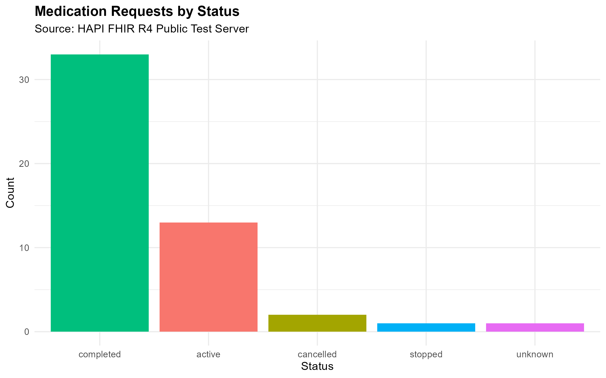

# Clinical Data Interoperability Explorer
### R-Based Healthcare Data Standards Portfolio Project
**Author:** Kristina Ankrah | Healthcare IT Professional | Clinical Informatics  
**GitHub:** [IT-Professional-Kristina](https://github.com/IT-Professional-Kristina)

---

## Project Overview

This project demonstrates working knowledge of the three core healthcare data interoperability standards used in modern clinical environments:

| Standard | Purpose | Status |
|----------|---------|--------|
| **FHIR R4** (Fast Healthcare Interoperability Resources) | Modern REST-based clinical data exchange | ✅ Complete |
| **HL7 v2** | Legacy pipe-delimited hospital messaging (ADT, ORU) | ✅ Complete |
| **DICOM** | Medical imaging data and metadata | ✅ Complete |

Built entirely in **R**, this project connects clinical domain expertise — including 6+ years of hands-on Epic EHR experience across Ambulatory, Willow Inpatient, and Beacon Oncology modules — with practical healthcare data engineering skills.

---

## Why This Matters in Healthcare IT

When a patient is admitted to a hospital, discharged, transferred, or prescribed a medication, that information doesn't stay in one system. It travels — between the EHR, the pharmacy system, the lab, the radiology department, and downstream reporting tools — using standardized message formats.

As a clinical informatics analyst, understanding how these standards work is essential to:
- Diagnosing why data didn't flow correctly between systems
- Supporting interface build, testing, and validation
- Ensuring compliance with CMS and ONC interoperability requirements
- Communicating with IT integration teams about data exchange issues

This project is a hands-on demonstration of that knowledge.

---

## Part 1: FHIR R4 — Patient & Medication Data Pipeline ✅

### What is FHIR?
FHIR (Fast Healthcare Interoperability Resources) is the modern standard for clinical data exchange, developed by HL7 International. It uses REST APIs and JSON — making it significantly more developer-friendly than older healthcare standards. Epic, Cerner, and virtually every major EHR now expose FHIR APIs, and CMS regulations require health systems to make patient data available via FHIR endpoints.

### What This Script Does
`01_fhir_query.R` connects to the public **HAPI FHIR R4 test server** and:
1. Queries **Patient resources** — pulling demographic data (name, gender, birth date)
2. Queries **MedicationRequest resources** — pulling active, completed, and stopped medication orders
3. Flattens nested FHIR JSON bundles into clean R data frames using `fhircrackr`
4. Produces a **clinical visualization** of medication request status distribution using `ggplot2`
5. Exports structured data as CSVs for downstream reporting use

### Output
| File | Description |
|------|-------------|
| `output/patients.csv` | Structured patient demographic data from FHIR |
| `output/medications.csv` | Medication request records with status and timestamps |
| `output/medication_status_chart.png` | ggplot2 visualization of medication status distribution |

### Sample Visualization


---

## Part 2: HL7 v2 — ADT Message Parser ✅

### What is HL7 v2?
HL7 version 2 is the pipe-delimited messaging standard still running in the majority of hospital systems today. When a patient is admitted, an **ADT A01** message is generated and sent to downstream systems. Understanding segments like `MSH`, `PID`, and `PV1` is essential for analysts who support interface monitoring, troubleshooting, and validation.

### What This Script Does
`02_hl7_parser.R`:
1. Ingests a sample HL7 v2.5 ADT A01 (Patient Admission) message
2. Parses the **MSH segment** — message header, sending system, message type, version
3. Parses the **PID segment** — patient demographics: MRN, name, DOB, gender, address
4. Parses the **PV1 segment** — ward, room, bed, attending service, visit number
5. Produces a formatted **Clinical Admission Summary** combining all three segments

### Sample Output
```
========================================
     HL7 ADT A01 — PATIENT ADMISSION    
========================================

       Category             Value
   Message Type           ADT^A01
Message DateTime  20260517083000
  Sending System              EPIC
     Patient MRN         MRN123456
    Patient Name        JOHN SMITH
  Date of Birth          19801215
         Gender                 M
       Location  3WEST | Room 301 | Bed A
Attending Service             MED
    Visit Number         VIS123456

========================================
```

---

## Part 3: DICOM — Medical Imaging Metadata Explorer ✅

### What is DICOM?
DICOM (Digital Imaging and Communications in Medicine) is the universal standard for medical imaging. Every CT, MRI, X-ray, and ultrasound is stored as a DICOM file containing both **pixel image data** and a structured **metadata header** with patient information, study details, and imaging parameters. Analysts working in radiology IT or any role touching PACS systems must understand how DICOM carries and protects patient data.

### What This Script Does
`03_dicom_explorer.R`:
1. Loads a real DICOM file using the `oro.dicom` package
2. Extracts and displays the **metadata header** — modality, patient ID, image dimensions
3. Renders the **medical image** in R using a greyscale colormap
4. Demonstrates DICOM anonymization — a critical HIPAA compliance workflow

### Key Findings
- **Modality:** OT (Other Imaging)
- **Image Dimensions:** 512 x 512 pixels
- **Patient fields:** Anonymized — demonstrating DICOM's built-in PHI de-identification capability

### Sample Output


---

## Complete File Structure

```
clinical-interoperability-explorer/
│
├── 01_fhir_query.R          # FHIR R4 patient & medication pipeline
├── 02_hl7_parser.R          # HL7 v2 ADT message parser
├── 03_dicom_explorer.R      # DICOM metadata extraction & imaging
│
├── output/
│   ├── patients.csv                    # FHIR patient data
│   ├── medications.csv                 # FHIR medication data
│   ├── medication_status_chart.png     # ggplot2 visualization
│   └── dicom_image.png                 # Rendered medical image
│
└── README.md
```

---

## Clinical Background & Context

Built by a healthcare IT professional with:
- **6+ years of direct clinical experience** across Johns Hopkins Medicine (Sibley Memorial), UVA Health (Novant Health Prince William Medical Center), Inova Health System (Inova Schar Cancer Center), and VHC Health
- **Hands-on Epic EHR expertise** across EpicCare Ambulatory, Willow Inpatient, Beacon Oncology, and ED modules
- **B.S. in Information Technology**, GPA 3.93, Summa Cum Laude, Colorado Technical University (2023)

### Related Portfolio Projects
- [Azure Genomics Research Platform](https://github.com/IT-Professional-Kristina/azure-genomics-research-platform) — Live Cosmos DB with pathogenic oncology variants, CI/CD pipeline, clinical dashboard
- [Genomic Cosmos AWS DynamoDB](https://github.com/IT-Professional-Kristina/genomic-cosmos-aws-db) — Node.js genomic variant database on AWS

---

## How to Run

```r
install.packages(c("fhircrackr", "dplyr", "ggplot2", "stringr", "oro.dicom"))
```

Open each script in RStudio and run in order. Part 1 requires an internet connection to reach the HAPI FHIR public test server.

---

## Data Sources & Privacy Note

- **FHIR:** HAPI FHIR R4 Public Test Server — synthetic test data only
- **HL7:** Sample message constructed from standard HL7 v2.5 specification — no real patient data
- **DICOM:** DICOM Library public sample — fully anonymized imaging data

No real patient data is used or stored in this repository.

---

*This project is part of an active healthcare IT portfolio demonstrating clinical informatics, data interoperability, and healthcare systems knowledge.*
